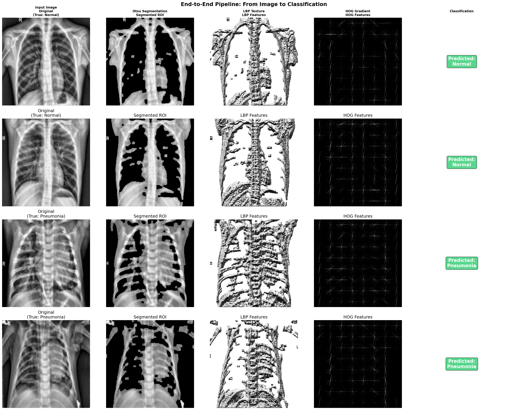
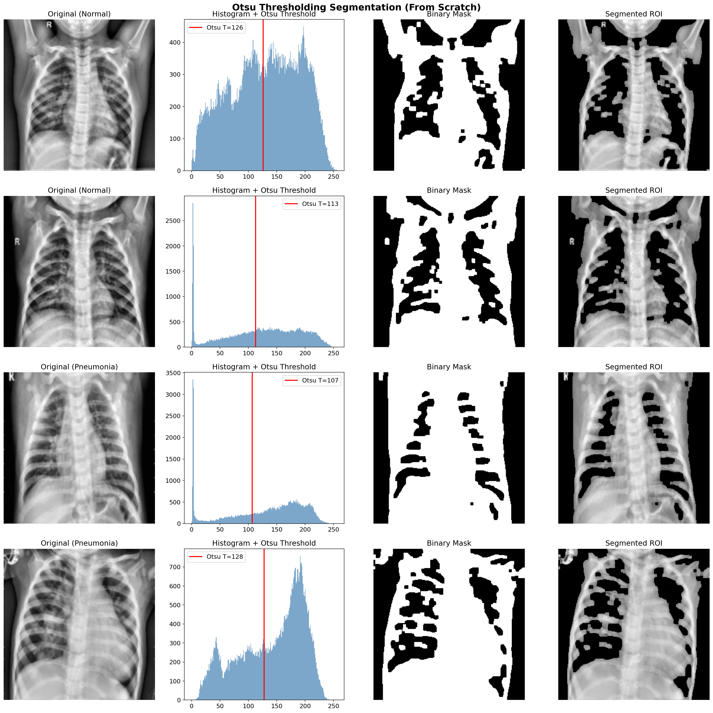
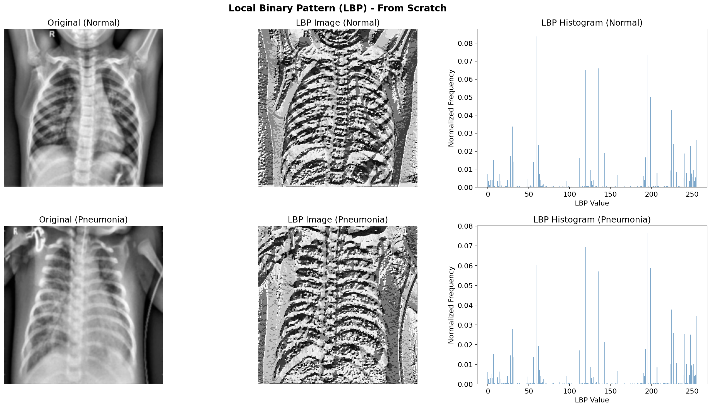
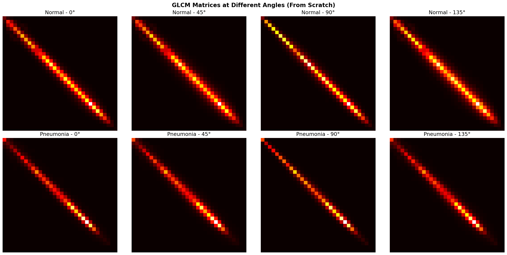
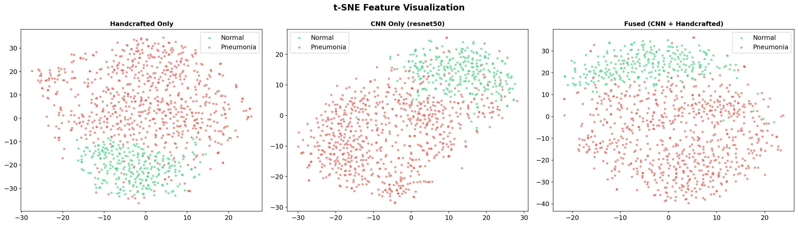
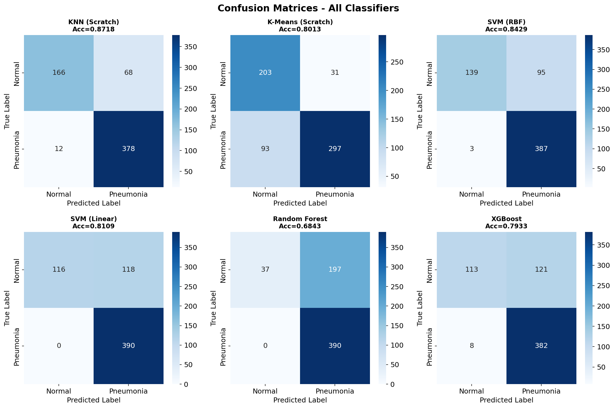
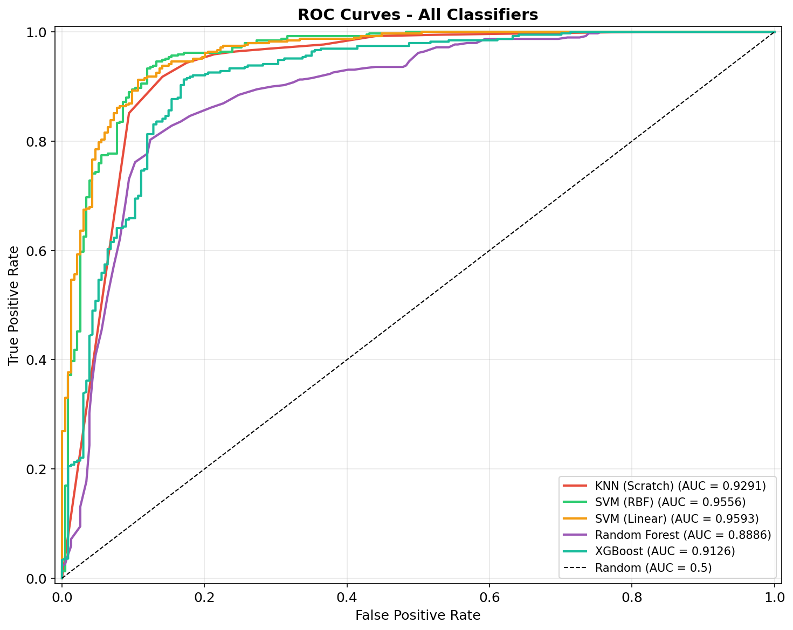
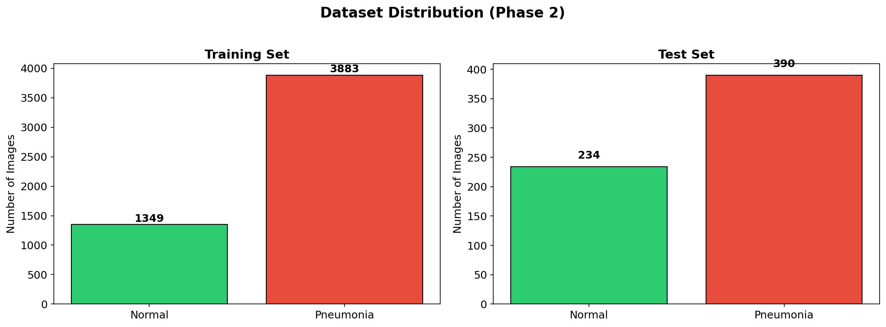

<div align="center">

# PneumoScan AI

### Automated Pneumonia Detection from Chest X-Ray Images Using Hybrid Feature Fusion

[](https://chest-xray-classifier-bfm63vygejmnpn4pebvzty.streamlit.app/)
[](https://www.python.org/)
[](https://pytorch.org/)
[](LICENSE)

A comprehensive chest X-ray classification system that fuses **handcrafted texture features** (LBP, GLCM, HOG) with **deep CNN features** (ResNet50) for accurate pneumonia detection. Key algorithms implemented **from scratch** using pure NumPy.

[**Live Demo**](https://chest-xray-classifier-bfm63vygejmnpn4pebvzty.streamlit.app/) | [**Research Paper**](#results) | [**Dataset**](https://www.kaggle.com/datasets/paultimothymooney/chest-xray-pneumonia)

</div>

---

## Pipeline Architecture

```
                            PneumoScan AI - Classification Pipeline
 ___________________________________________________________________________________________
|                                                                                           |
|   INPUT                PREPROCESSING              SEGMENTATION          FEATURE EXTRACTION |
|  --------             ---------------            --------------        ------------------- |
|                                                                                           |
|  +----------+    +-------------------+    +----------------+    +----------------------+  |
|  |  Chest   |    |  1. Resize 256x256|    |    Otsu's      |    |   HANDCRAFTED        |  |
|  |  X-Ray   |--->|  2. Gaussian Blur |--->|  Thresholding  |--->|   - LBP (256-dim)    |  |
|  |  Image   |    |  3. CLAHE         |    |  (From Scratch)|    |   - GLCM (24-dim)    |  |
|  +----------+    |  4. FFT Low-Pass  |    +-------+--------+    |   - HOG (1,764-dim)  |  |
|                  +-------------------+            |             +----------+-----------+  |
|                                                   |                        |              |
|                                                   v                        | 2,044 feat.  |
|                                            +------+-------+               |              |
|                                            | Segmented ROI|               v              |
|                                            +--------------+    +----------+-----------+  |
|                                                                |   FEATURE FUSION     |  |
|  +----------+                                                  |   Concatenation       |  |
|  | Pretrained|    +-------------------+                        |   (4,092 features)    |  |
|  | ResNet50  |--->| CNN Features      |---2,048 feat.--------->|                       |  |
|  | (ImageNet)|    | (Avg Pool -> FC)  |                        +-----------+-----------+  |
|  +----------+    +-------------------+                                     |              |
|                                                                            v              |
|                                                                 +----------+-----------+  |
|                                                                 |   PCA (From Scratch) |  |
|                                                                 |   95% variance       |  |
|                                                                 |   4,092 -> 864 dim   |  |
|                                                                 +-----------+----------+  |
|                                                                             |             |
|                                                                             v             |
|                  +------------------------------------------------------------+           |
|                  |                    CLASSIFICATION                          |           |
|                  |  +-------+  +-------+  +-------+  +-------+  +--------+  |           |
|                  |  |  KNN  |  |  SVM  |  |  SVM  |  |  Rand |  |XGBoost |  |           |
|                  |  | K=11  |  | (RBF) |  |(Lin.) |  |Forest |  |        |  |           |
|                  |  |Scratch|  |       |  |       |  |       |  |        |  |           |
|                  |  +---+---+  +---+---+  +---+---+  +---+---+  +---+----+  |           |
|                  +------+----------+----------+----------+----------+--------+           |
|                         |          |          |          |          |                     |
|                         v          v          v          v          v                     |
|                  +------+----------+----------+----------+----------+--------+           |
|                  |              DIAGNOSIS: NORMAL / PNEUMONIA                 |           |
|                  +-----------------------------------------------------------+           |
|___________________________________________________________________________________________|
```

## Visual Results

### Segmentation & Feature Extraction Pipeline
<div align="center">

<p><i>End-to-end pipeline: Input Image → Otsu Segmentation → LBP Features → HOG Features → Classification</i></p>
</div>

### Otsu Thresholding Segmentation (From Scratch)
<div align="center">

<p><i>Automatic lung region extraction using from-scratch Otsu thresholding</i></p>
</div>

### Feature Visualizations
<div align="center">

| LBP Texture Features | GLCM Co-occurrence Matrices |
|:---:|:---:|
|  |  |
| *Local Binary Pattern extracts texture* | *GLCM at 4 angles captures co-occurrence* |

</div>

### t-SNE Feature Space Visualization
<div align="center">

<p><i>Handcrafted Only vs CNN Only vs Fused Features — fused features show best class separation</i></p>
</div>

### Classification Results
<div align="center">

<p><i>Confusion matrices for all six classifiers</i></p>
</div>

<div align="center">

<p><i>ROC curves — SVM (RBF) achieves highest AUC of 0.956</i></p>
</div>

---

## Results

### Classifier Performance Comparison (Fused Features + PCA)

| Classifier | Accuracy | Sensitivity | Specificity | Precision | F-measure | AUC-ROC | Kappa |
|:---|:---:|:---:|:---:|:---:|:---:|:---:|:---:|
| **KNN (Scratch, K=11)** | **87.18%** | 96.92% | **70.94%** | 84.75% | 90.43% | 0.929 | **0.713** |
| K-Means (Scratch) | 80.13% | 76.15% | 86.75% | 90.55% | 82.73% | - | 0.597 |
| SVM (RBF) | 84.29% | 99.23% | 59.40% | 80.29% | 88.76% | **0.956** | 0.636 |
| SVM (Linear) | 81.09% | **100.0%** | 49.57% | 76.77% | 86.86% | 0.959 | 0.551 |
| Random Forest | 68.43% | **100.0%** | 15.81% | 66.44% | 79.84% | 0.889 | 0.190 |
| XGBoost | 79.33% | 97.95% | 48.29% | 75.94% | 85.55% | 0.913 | 0.512 |

### CNN Architecture Comparison

| Architecture | Feature Dim | Accuracy | AUC-ROC | Kappa |
|:---|:---:|:---:|:---:|:---:|
| **ResNet50** | **2,048** | **84.29%** | **0.956** | **0.636** |
| EfficientNet-B0 | 1,280 | 81.89% | 0.954 | 0.575 |
| VGG16 | 512 | 81.73% | 0.949 | 0.570 |
| VGG19 | 512 | 79.97% | 0.949 | 0.522 |

### Feature Type Comparison (SVM RBF)

| Feature Type | Dimensions | Accuracy | Specificity | AUC-ROC |
|:---|:---:|:---:|:---:|:---:|
| Handcrafted Only | 2,044 | 79.49% | 46.15% | 0.946 |
| **CNN Only (ResNet50)** | **2,048** | **87.34%** | **67.95%** | 0.950 |
| Fused (CNN + HC) | 4,092 → 864 | 84.29% | 59.40% | **0.956** |

---

## From-Scratch Implementations

All core algorithms implemented using **pure NumPy** (no scikit-learn):

| Algorithm | Purpose | Implementation |
|:---|:---|:---|
| Otsu Thresholding | Lung segmentation | Inter-class variance maximization |
| LBP | Texture feature extraction | 8-point neighborhood, 256-bin histogram |
| GLCM | Co-occurrence features | 4 angles x 6 statistical features |
| PCA | Dimensionality reduction | Covariance → eigendecomposition |
| KNN | Classification | Euclidean distance, majority voting |
| K-Means | Clustering | K-Means++ init, Lloyd's algorithm |

---

## Dataset

[Chest X-Ray Images (Pneumonia)](https://www.kaggle.com/datasets/paultimothymooney/chest-xray-pneumonia) by Kermany et al.

- **5,856** validated pediatric chest X-ray images
- **2 classes:** Normal (1,583) and Pneumonia (4,273)
- **Source:** Guangzhou Women and Children's Medical Center, China
- **Split:** 5,232 training / 624 test

<div align="center">

</div>

---

## Project Structure

```
chest-Xray-Classifier/
├── app.py                                    # Streamlit web application
├── Phase1_Chest_Xray_Preprocessing.ipynb     # Phase 1: Preprocessing pipeline
├── Phase2_Chest_Xray_Classification.ipynb    # Phase 2: Full classification pipeline
├── requirements.txt                          # Python dependencies
├── runtime.txt                               # Python version for deployment
├── models/                                   # Trained models & scalers
│   ├── config.pkl                            # Pipeline configuration
│   ├── svm_rbf.pkl                           # SVM (RBF) classifier
│   ├── svm_linear.pkl                        # SVM (Linear) classifier
│   ├── random_forest.pkl                     # Random Forest classifier
│   ├── xgboost.pkl                           # XGBoost classifier
│   ├── knn_train_X.npy                       # KNN training features
│   ├── knn_train_y.npy                       # KNN training labels
│   ├── knn_best_k.pkl                        # Optimal K value (11)
│   ├── scaler_cnn.pkl                        # CNN feature scaler
│   ├── scaler_hc.pkl                         # Handcrafted feature scaler
│   └── pca_scratch.pkl                       # PCA model (from scratch)
├── figures/                                  # Generated visualizations
│   ├── pipeline_example.png
│   ├── segmentation_otsu.png
│   ├── lbp_visualization.png
│   ├── glcm_visualization.png
│   ├── confusion_matrices.png
│   ├── roc_curves.png
│   └── ...
└── results/                                  # Evaluation metrics (CSV)
```

---

## Local Setup

```bash
# Clone
git clone https://github.com/AlaaElkholy16/chest-Xray-Classifier.git
cd chest-Xray-Classifier

# Install dependencies
pip install -r requirements.txt

# Run the app
streamlit run app.py
```

---

## Tech Stack

| Component | Technology |
|:---|:---|
| Language | Python 3.11 |
| Deep Learning | PyTorch, torchvision (ResNet50, VGG16/19, EfficientNet-B0) |
| Image Processing | OpenCV, scikit-image |
| ML Classifiers | scikit-learn (SVM, RF), XGBoost |
| Web App | Streamlit |
| Core Algorithms | NumPy (from-scratch implementations) |

---

## Live Demo

**[https://chest-xray-classifier-bfm63vygejmnpn4pebvzty.streamlit.app/](https://chest-xray-classifier-bfm63vygejmnpn4pebvzty.streamlit.app/)**

Upload any chest X-ray image and get an instant pneumonia diagnosis with confidence scores, segmentation overlay, and feature visualizations.

---

<div align="center">

*Digital Image Processing Course Project — Phase 2: Classification, Segmentation & Clustering*

</div>
